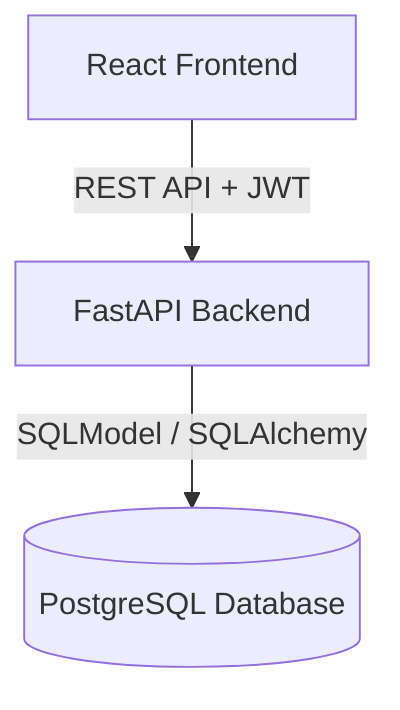

# 🚀 LOANFLOW – Enterprise Loan Management Platform

LOANFLOW is a production-ready, full-stack enterprise application that streamlines the end-to-end loan lifecycle.
It enables **customers to apply for loans**, **analysts to review/approve applications**, and **administrators to manage users and system metrics** — all secured using **JWT authentication** and **role-based access control (RBAC)**.

This project demonstrates modern software engineering practices: a high-performance **FastAPI** backend, **SQLModel** for database integrity, and a premium **React (TypeScript)** frontend.

---

## 🌐 Live Demo

> 🔗 **Frontend:** [https://loanflow-frontend.vercel.app](https://loanflow-frontend.vercel.app) *(Coming Soon)*
> 🔗 **Backend API:** [https://loanflow-api.railway.app](https://loanflow-api.railway.app) *(Coming Soon)*

### 🔑 Demo Credentials

| Role     | Username | Password    |
| -------- | -------- | ----------- |
| Admin    | admin    | admin123    |
| Analyst  | analyst3 | Ana         |
| Customer | sai      | Sai         |

---

## 🏗 Architecture Overview



---

## ✨ Core Features

### 🔐 Security & RBAC
* JWT-based stateless authentication.
* Role-based authorization: **ADMIN**, **ANALYST**, and **CUSTOMER**.
* BCrypt password hashing for secure storage.
* CORS protection and secure API headers.

### 👤 Customer Experience
* Streamlined application forms for new loans.
* Real-time status tracking via personal dashboards.
* Transparent view of historical applications.

### 🧑‍💼 Analyst Workflow
* Centralized queue for pending applications.
* One-click Approval/Rejection with status synchronization.
* Advanced filtering and paginated data tables.

### 🛠 Administrative Control
* Real-time system metrics and platform health overview.
* Comprehensive user management (Activate/Deactivate/Role Assignment).
* Direct database integrity monitoring.

---

## 🧰 Technology Stack

### Frontend
* **React 19** (TypeScript)
* **Material UI (MUI)** for premium components
* **Framer Motion** for smooth, futuristic animations
* **React Router 7** for optimized navigation
* **Axios** for API orchestration

### Backend
* **Python 3.x**
* **FastAPI** (High-performance asynchronous framework)
* **SQLModel / SQLAlchemy** (ORM)
* **Pydantic** for data validation
* **python-jose** for JWT management
* **Uvicorn** (ASGI Server)

### Database
* **PostgreSQL** (Hosted on Supabase/AWS RDS)

---

## 📂 Project Structure

```text
LOANFLOW/
 ├── backend/        → FastAPI Python Backend
 │    ├── auth.py    → JWT & Security logic
 │    ├── main.py    → API Router & Endpoints
 │    ├── models.py  → Database Schemas (SQLModel)
 │    └── requirements.txt
 ├── frontend/       → React TypeScript Frontend
 │    ├── src/pages/ → Dashboard & Feature views
 │    └── src/theme/ → Bespoke Cyber/Visual overrides
 └── .gitignore
```

---

## ⚙️ Local Development Setup

### ✅ Prerequisites
* **Python 3.10+**
* **Node.js 18+**
* **Git**

### ▶️ Backend Setup
1. Navigate to backend: `cd backend`
2. Create virtual environment: `python -m venv venv`
3. Activate venv: `.\venv\Scripts\activate` (Windows) or `source venv/bin/activate` (Mac/Linux)
4. Install dependencies: `pip install -r requirements.txt`
5. Run server: `uvicorn main:app --reload`

*Backend runs at: `http://localhost:8000`*

### ▶️ Frontend Setup
1. Navigate to frontend: `cd frontend`
2. Install dependencies: `npm install`
3. Start development server: `npm start`

*Frontend runs at: `http://localhost:3000`*

---

## 👨‍💻 Author

**Sai Vamshi Dasari**
Master’s in Computer Science
Full Stack Software Engineer

📧 Email: [saivamshidasari48@gmail.com](mailto:saivamshidasari48@gmail.com)
🔗 LinkedIn: [https://www.linkedin.com/in/sai-vamshi-dasari-91279639a/](https://www.linkedin.com/in/sai-vamshi-dasari-91279639a/)
💻 GitHub: [https://github.com/saivamshidasari9-ux](https://github.com/saivamshidasari9-ux)

---
*Cleaned and updated: March 2026*
